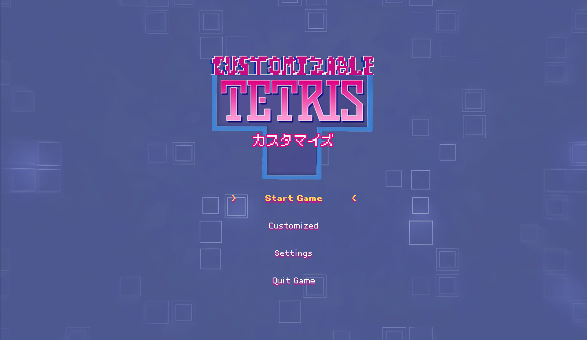
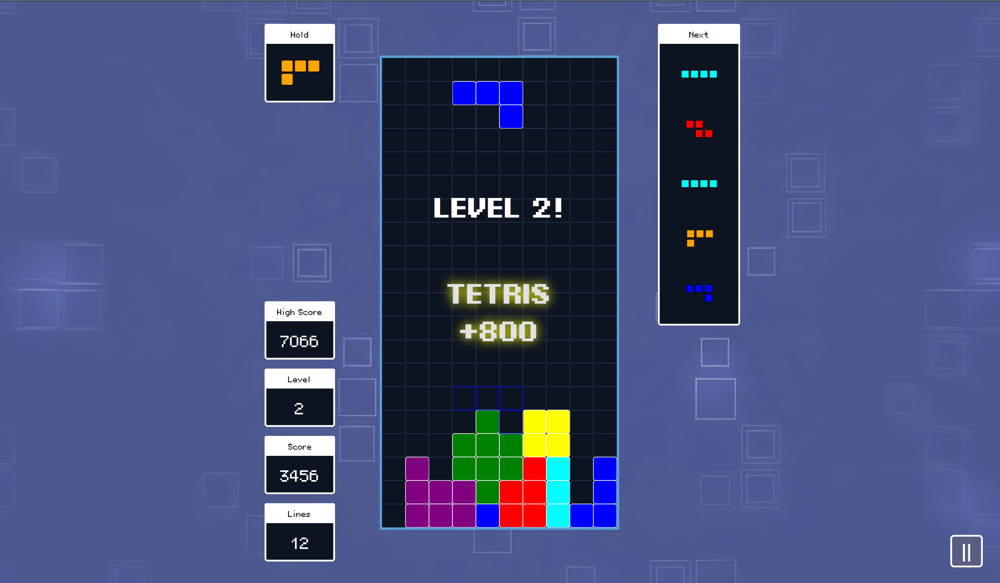
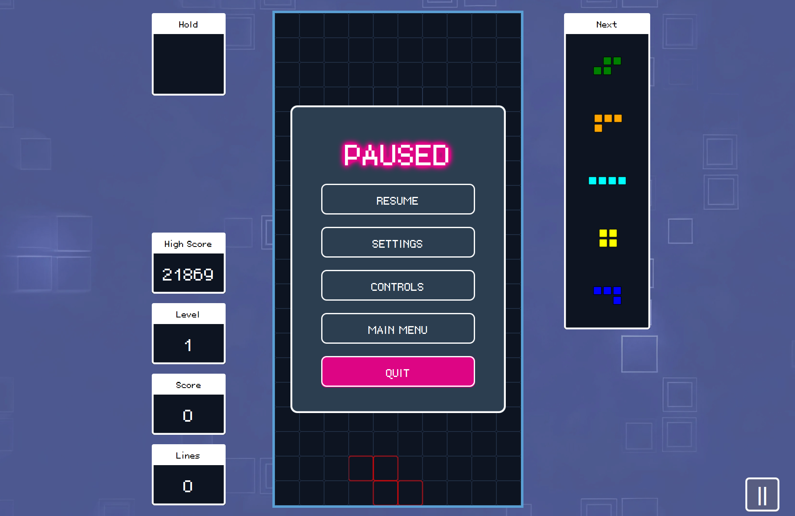
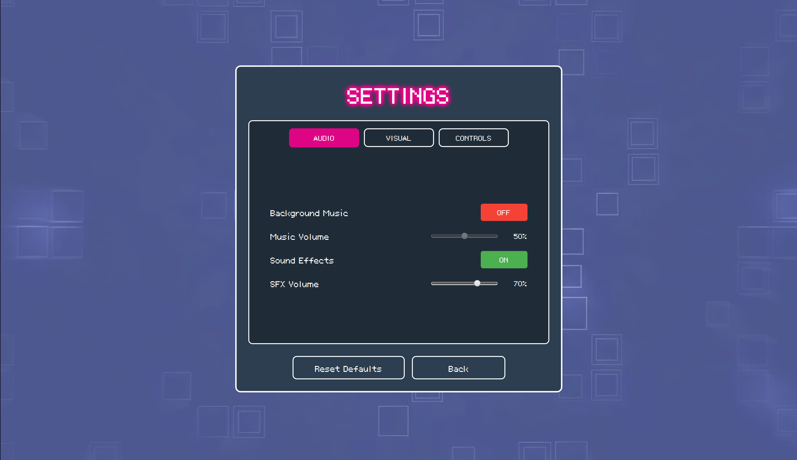
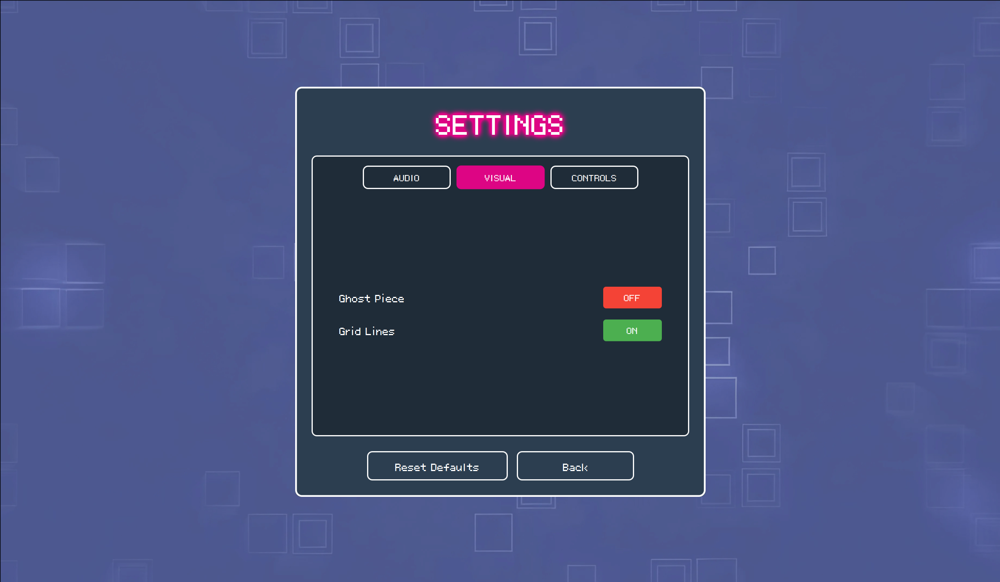
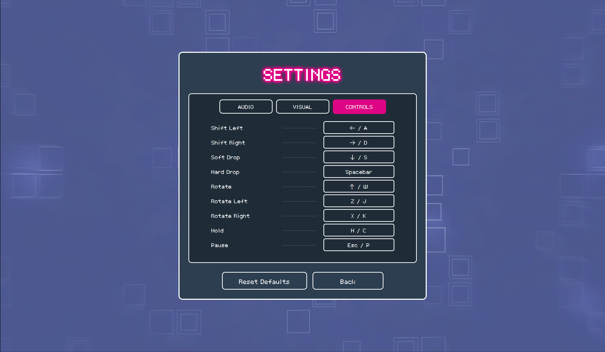
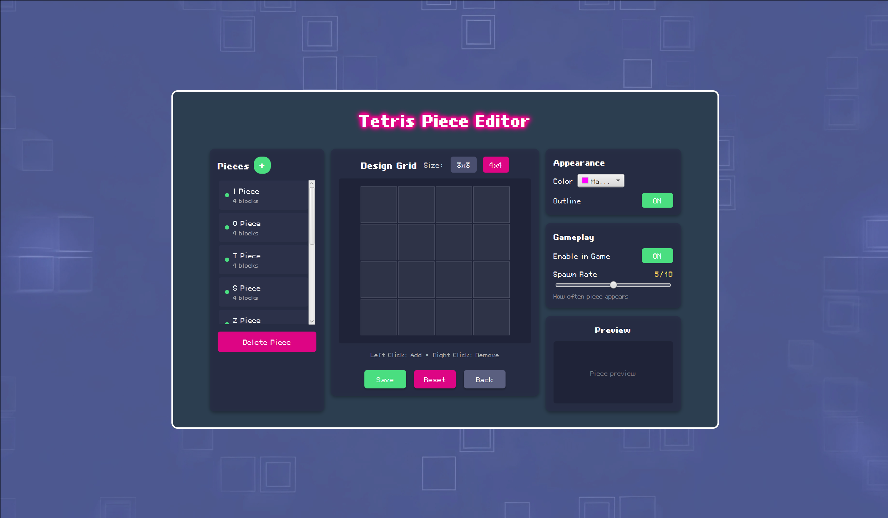
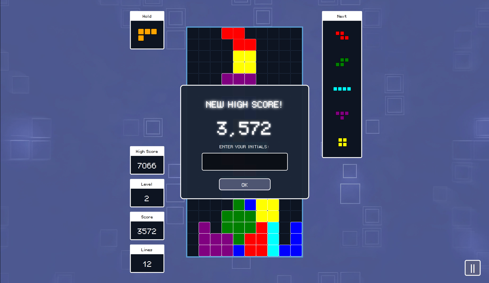
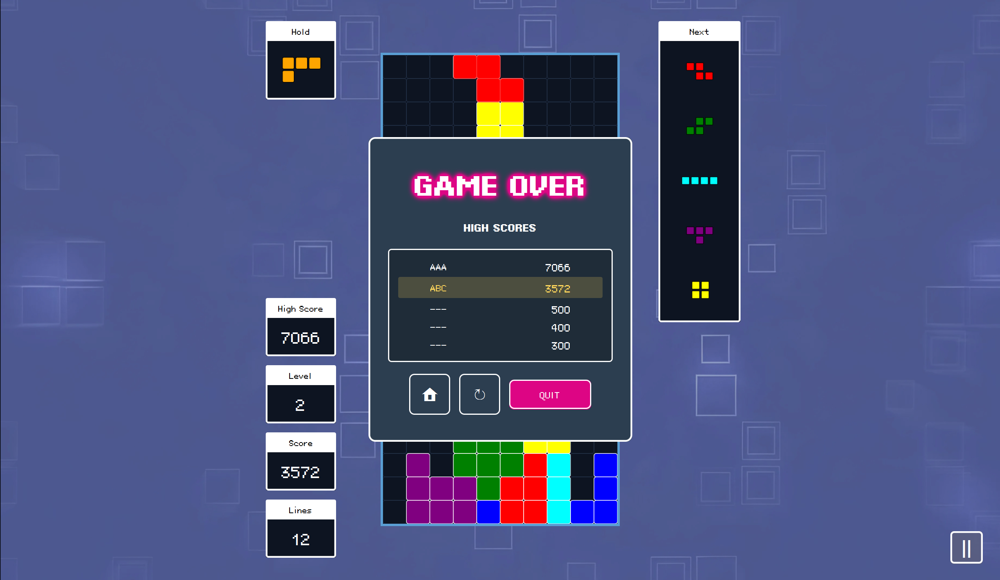

# COMP2042 Developing Maintainable Software

---

## 1.0 Github
**Name:** Wong Cheuk Kei <br>
**Student ID:** 20602511 <br>
**Link:** https://github.com/k31k1w0n9/CW2025

---

## 2.0 Compilation Instructions
### 2.1 System Requirements

#### Prerequisites
*   **Java Development Kit (JDK):** 23 or later
*   **Apache Maven:** 3.9.0 or later
*   **JavaFX SDK:** 21 or later
*   **Git:** (Optional, for cloning the repository)

#### Recommended IDEs
*   IntelliJ IDEA 2023.3+ (Ultimate or Community Edition)
*   Eclipse 2023-12+
*   VS Code with Java Extension Pack

#### Environment Setup

##### 1. Install Java Development Kit (JDK)
Download and install **JDK 23** from Oracle or use OpenJDK.

**Set JAVA_HOME environment variable:**

**Windows (PowerShell Administrator):**
```powershell
[Environment]::SetEnvironmentVariable("JAVA_HOME", "C:\Program Files\Java\jdk-23", "Machine")
[Environment]::SetEnvironmentVariable("Path", $env:Path + ";%JAVA_HOME%\bin", "Machine")
```

**Unix/MacOS:**
```bash
echo 'export JAVA_HOME=/Library/Java/JavaVirtualMachines/jdk-23.jdk/Contents/Home' >> ~/.bash_profile
echo 'export PATH=$JAVA_HOME/bin:$PATH' >> ~/.bash_profile
source ~/.bash_profile
```

**Verify Installation:**
```bash
java --version
# Should output Java 23 or higher
```

##### 2. Install JavaFX SDK
* Download JavaFX SDK 21 from [OpenJFX](https://openjfx.io/).
* Extract it to user's preferred location.

**Add to PATH (Optional, since Maven can handle dependencies):**

**Windows (PowerShell Administrator):**
```powershell
[Environment]::SetEnvironmentVariable("PATH_TO_FX", "C:\Path\To\javafx-sdk-21\lib", "Machine")
```

**Unix/MacOS:**
```bash
echo 'export PATH_TO_FX=/path/to/javafx-sdk-21/lib' >> ~/.bash_profile
source ~/.bash_profile
```

##### 3. Install Git
*   **Windows:** Download and install from [Git for Windows](https://git-scm.com/download/win).
*   **macOS:** Install via Homebrew: `brew install git`
*   **Linux:** `sudo apt-get install git` (Ubuntu/Debian) or `sudo dnf install git` (Fedora).

**Verify Installation:**
```bash
git --version
```

##### 4. Install Apache Maven
* Download from the [Maven Official Site](https://maven.apache.org/download.cgi).
* Add Maven to your PATH.

**Verify Installation:**
```bash
mvn --version
```

### 2.2 Project Initialisation

#### Clone the Repository
```bash
git clone https://github.com/k31k1w0n9/CW2025.git
cd CW2025
```

#### IDE Configuration

**IntelliJ IDEA**
1.  Select **Open** or **Import** and navigate to the `CW2025` folder.
2.  Choose to import as a **Maven Project**.
3.  Navigate to **File > Project Structure > Project** and confirm the SDK is set to **JDK 23**.
4.  When the project opens, `pom.xml` will automatically trigger dependency import.
    - If dependencies do not load, click the **Maven** tool window icon (M) on the right sidebar.
    - Click the **Refresh** (sync) icon to reload the Maven project.
5.  To build the project, expand the **Maven** tool window, then under **Lifecycle**, run:
    - `clean` → removes previous build artifacts
    - `install` → compiles and packages the project locally
6.  To run the game, go to **Plugins > javafx > javafx:run** and double-click to launch.

**Eclipse**
1.  Go to **File > Import > Maven > Existing Maven Projects**.
2.  Select the project root directory and click Finish.
3.  Right-click the project folder, select **Properties**, then **Java Build Path**.
4.  Verify that the JRE System Library matches **JDK 23**.

**Visual Studio Code**
1.  Ensure the **Extension Pack for Java** is installed.
2.  Open the `CW2025` folder via **File > Open Folder**.
3.  Open an integrated terminal via **Terminal > New Terminal**.
4.  If the terminal path is not inside the project directory, navigate to it:
    ```bash
    cd <path-to-project>/CW2025
    ```
5.  Allow the Java Language Server to initialise and import the Maven project.
6.  Use the terminal commands below, or use the **Maven** sidebar to execute lifecycle goals.

### 2.3 Compilation and Execution

The following commands can be run from your terminal (PowerShell, Command Prompt, or Bash) after navigating to the project directory.

**Navigate to Project Directory:**
```bash
cd <path-to-project>/CW2025
```

**Build the Project (Full Build):**
```bash
mvn clean install
```

**Compile Only (No Tests):**
```bash
mvn clean compile
```

**Launch the Game:**
```bash
mvn javafx:run
```

**Run Unit Tests:**
```bash
mvn test
```

**Build Executable JAR:**
```bash
mvn package
# Should create a JAR file in the `target` directory
```

**Run the Packaged JAR:**
```bash
java -jar target/CW2025-1.0-SNAPSHOT.jar
```

---

## 3.0 Features
### 3.1 Implemented and Working Properly
#### 1. Enhanced User Interface (UI)
- Completely redesigned UI with a **Neon, Pixelated, Retro** aesthetic
- Implemented separate panels for Main Menu, Pause Menu, Game Over, Settings, and Customisation
- Consistent styling, custom fonts, and hover effects across all buttons and menus

#### 2. Sound System
- Integrated `SoundManager` for background music and sound effects
- Added volume controls for both music and SFX in the Settings menu
- Distinct sounds for button clicks, line clears, start game, game over, and levelling up

#### 3. Game Customisation
- Added a **Customise Panel** allowing users to modify existing game visuals
- Support for creating custom brick shapes and selecting colours
- Changes are saved and applied immediately

#### 4. Configurable Controls
- Implemented a **Key Bindings** system via `ControlsPanel`
- Users can view and remap controls for movement, rotation, and pausing
- Bindings are saved and restored upon game restart

#### 5. High Score System
- `HighScoreManager` tracks and saves the top scores
- High scores are persistent across game sessions
- Displays the leaderboard on the Game Over screen

#### 6. Levelling and Difficulty
- Implemented `LevelSystem` to manage game progression
- Difficulty (speed of dropping bricks) increases as the player clears lines and levels up

#### 7. Advanced Gameplay Mechanics
- **Hold Piece:** Ability to swap the current piece with a held one
- **Ghost Piece:** Visual guide showing where the current piece will land
- **Hard Drop:** Instantly drop the piece to the bottom
- **Combos:** Scoring multipliers for consecutive line clears
- **7-Bag Randomization:** Implements the official Tetris Guideline algorithm, ensuring every sequence of 7 pieces contains exactly one of each shape to prevent long droughts of specific pieces
- **T-Spin Detection:** Recognizes advanced T-Spin moves (including T-Spin Mini and T-Spin Triple) for bonus points
- **Back-to-Back Scoring:** Awards 1.5x score multiplier for consecutive difficult line clears (Tetris or T-Spin)

### 3.2 Implemented but Not Working Properly
#### 1. Notification Overlap
- **Issue:** Rapid succession of events (e.g. Level Up immediately followed by a Combo) may occasionally cause notification text to overlap briefly
- **Status:** A queue system has been implemented to minimise this, but extremely fast events may still overlap

#### 2. Duplicate Key Bindings
- **Issue:** The controls configuration allows assigning the same key to multiple actions (e.g. setting 'SPACE' for both 'Hard Drop' and 'Rotate'). This results in ambiguous input handling where one key press triggers multiple actions.
- **Status:** Validation logic to check for duplicates before saving bindings is currently missing.

### 3.3 Not Implemented
#### 1. Multiplayer Mode
- **Reason:** Not implemented due to the significant architectural changes required for networking and the focus on polishing the single-player experience and code maintainability

#### 2. Customise Brick Size > 4x4
- **Reason:** Requires changing the entire code for UI in the next box and hold box to render larger size bricks properly

#### 3. Customise Panel Rotation Pivot
- **Reason:** Complex matrix math required to dynamically adjust pivot points for arbitrary user-created shapes was out of scope

#### 4. Load Image as Custom Brick
- **Reason:** Feature was deprioritized to focus on the grid-based editor and core gameplay stability

#### 5. Line Clear Animation
- **Reason:** Visual effects for clearing lines were not prioritised to the implementation of core gameplay mechanics and ensure system stability within the development timeframe.

---

## 4.0 Refactoring Process
### 4.1 New Java Classes
#### <ins>4.1.1 Managers</ins>
**com.comp2042.system**

| Class Name | Description |
|---|---|
| `SoundManager` | Singleton class managing all audio resources, BGM looping, and SFX playback. |
| `SettingsManager` | Manages global game settings (Audio, Visual, Controls) and persistence. |
| `HighScoreManager` | Handles loading, saving, and updating high scores to a local file. |
| `LevelSystem` | Manages game difficulty, tracking lines cleared and calculating speed. |

###
#### <ins>4.1.2 View/Panels</ins>
**com.comp2042.ui**

| Class Name | Description |
|---|---|
| `MainMenuPanel` | Encapsulates the main menu UI, separating it from the main controller. |
| `PauseMenuPanel` | Manages the pause overlay with options to resume, settings, or quit. |
| `SettingsPanel` | Provides a tabbed UI for adjusting Audio, Visuals, and Controls. |
| `CustomizePanel` | Allows players to design custom bricks and select colors. |
| `ControlsPanel` | Displays current key bindings and allows users to remap controls. |
| `NameInputDialog` | Custom dialog for entering player name for high scores. |

###
#### <ins>4.1.3 Logic/Data</ins>
**com.comp2042.system**

| Class Name | Description |
|---|---|
| `GameSettings` | Data class holding the current configuration state of the game. |
| `KeyBindings` | Manages the mapping between game actions and keyboard inputs. |

**com.comp2042.domain.bricks**

| Class Name | Description |
|---|---|
| `CustomBrick` | Extends basic brick functionality to support user-defined Customisations. |

### 4.2 Modified Java Classes
#### <ins>4.2.1 Core</ins>
**com.comp2042.core**

| Class Name | Refactoring | Enhancement |
|---|---|---|
| `GuiController` | Transformed into a central coordinator that manages specific subpanels (`MainMenuPanel`, etc.) rather than handling all UI logic directly | Integrated `SoundManager`, `SettingsManager`, and `LevelSystem`. Added logic for Hold Piece and Ghost Piece rendering |
| `GameController` | Decoupled input handling and game loop logic from the view | Integrated `LevelSystem` to dynamically adjust speed based on progression |

###
#### <ins>4.2.2 Logic</ins>
**com.comp2042.logic**

| Class Name | Refactoring | Enhancement |
|---|---|---|
| `SimpleBoard` | Updated to support `CustomBrick` rendering and `GameSettings` integration | Added logic for Combo detection, Ghost Piece calculation, and Hold Piece functionality |
| `MatrixOperations` | Extended matrix manipulation capabilities | Added support for rotating and validating arbitrary `CustomBrick` shapes |

###
#### <ins>4.2.3 Domain</ins>
**com.comp2042.domain**

| Class Name | Refactoring | Enhancement |
|---|---|---|
| `RandomBrickGenerator` | Moved from `logic.bricks` to `domain` and completely rewrote the generation algorithm | Replace simple randomisation with **7-Bag Randomization**, ensuring a fair and balanced distribution of pieces compliant with modern Tetris guidelines |

### 4.3 Additional Notes
#### 1. Adoption of MVC and Modular Design
- **Issue**: The original codebase had huge classes that mixed game logic and UI together.
- **Solution**: Split the UI into different Panel classes and move the logic into Managers. This improved code readability and maintainability

#### 2. Centralised Resource Management
- **Issue**: Resources like sounds and settings were either spread across different places or hardcoded
- **Solution**: Created `SoundManager` and `SettingsManager` to centralise control, making it easier to update assets and configurations

#### 3. Binary File Storage (.dat) Instead of Text Files (.txt)
- **Issue**: Data persistence for settings and high scores needed to be reliable and not easily tampered with
- **Solution**: Used binary serialisation (`.dat` files) instead of plain text files. `SettingsManager` stores settings using `Properties` with binary streams, while `HighScoreManager` serialises `ArrayList<HighScoreEntry>` using `ObjectOutputStream`. This provides better security (not human-readable), efficiency (fast serialisation of complex objects), and type safety

#### 4. Organised files into proper packages
- **Issue**: The project structure was messy, making it challenging to locate and manage files.
- **Solution**: Classes are grouped into packages based on their functionality, making the project easier to navigate and maintain.

```
com.comp2042
├───Main.java
├───core
│   ├───GameController.java
│   ├───GuiController.java
│   └───InputEventListener.java
├───data
│   ├───ClearRow.java
│   ├───DownData.java
│   ├───NextShapeInfo.java
│   └───ViewData.java
├───domain
│   ├───bricks
│   │   ├───CustomBrick.java
│   │   ├───IBrick.java
│   │   ├───JBrick.java
│   │   ├───LBrick.java
│   │   ├───OBrick.java
│   │   ├───SBrick.java
│   │   ├───TBrick.java
│   │   └───ZBrick.java
│   ├───Brick.java
│   ├───BrickGenerator.java
│   └───RandomBrickGenerator.java
├───events
│   ├───EventSource.java
│   ├───EventType.java
│   └───MoveEvent.java
├───logic
│   ├───Board.java
│   ├───BrickRotator.java
│   ├───MatrixOperations.java
│   ├───Score.java
│   └───SimpleBoard.java
├───system
│   ├───GameSettings.java
│   ├───HighScoreManager.java
│   ├───KeyBindings.java
│   ├───LevelSystem.java
│   ├───SettingsManager.java
│   └───SoundManager.java
└───ui
    ├───ControlsPanel.java
    ├───CustomizePanel.java
    ├───GameOverPanel.java
    ├───MainMenuPanel.java
    ├───NameInputDialog.java
    ├───NotificationPanel.java
    ├───PauseMenuPanel.java
    └───SettingsPanel.java
```

#### 5. Deleted or Replaced Files
The following files from the original codebase were deleted or replaced during the refactoring process:

**Resources:**
- `background_image.png`: Deleted and replaced with `background.png` to match the new retro aesthetic.
- `digital.ttf`: Deleted and replaced with the `BoutiqueBitmap` font family for better readability and style.

---

## 5.0 Unexpected Problems
1. **Ghost Piece Offset Issue**
- **Issue**: The ghost piece sometimes cannot be landed correctly on the bottom of the game board or rendered out of the game board bounds
- **Resolution**: Attempted to clamp coordinates within board limits, but edge cases with custom shapes remain

2. **UI Position Off on Different Screen Sizes**
- **Issue**: The UI elements (Next Box, Hold Box, Score) shift positions or become misaligned when the game is played on screens with different resolutions or aspect ratios
- **Resolution**: Implemented dynamic cell sizing based on screen height, but absolute positioning in some panels still causes layout shifts

3. **FXML ClassNotFound Exceptions**
- **Issue**: Encountered persistent `ClassNotFoundException` errors when loading FXML files for custom components
- **Resolution**: Refactored the FXML loading strategy to instantiate components programmatically within `GuiController`

4. **Notification Overlap**
- **Issue**: Multiple game events (e.g. "Tetris" + "Level Up") triggering simultaneously caused texts to overlap and become unreadable
- **Resolution**: Implemented a priority queue system in `NotificationPanel`. New notifications now wait for the current animation to finish before displaying

5. **Font Loading Issues**
- **Issue**: Custom fonts occasionally failed to load depending on the execution environment, causing the UI to look broken
- **Resolution**: Implemented a robust font loading mechanism with error handling and automatic fallback to system fonts (Arial) if the custom resources cannot be found

6. **Auto-Fall Timer Bug**
- **Issue**: The auto-fall timer failed to restart when starting a new game after returning to the main menu
- **Resolution**: Fixed in `GuiController` by ensuring the timeline is properly stopped and recreated on game start

7. **Settings Persistence Reset**
- **Issue**: "Reset to Defaults" sometimes failed to apply immediately or persist after restart
- **Resolution**: Updated `SettingsManager` to force a write-to-disk operation immediately upon reset and reload properties

---

## 6.0 Gameplay Screenshots

### Main Menu


### Game Board


### Pause Menu


### Settings Menu - Audio


### Settings Menu - Visual


### Settings Menu - Controls


### Customize Menu


### Name Input (High Score)


### Game Over

